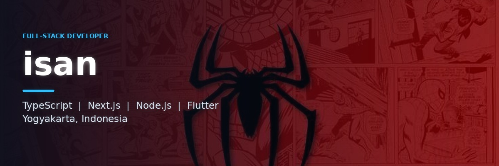

<div align="center">



<a href="https://github.com/Ikhsansukaweb">
  
</a>

<br/>

<a href="https://github.com/Ikhsansukaweb?tab=followers">
  
</a>


</div>

<br/>

<table>
<tr>
<td width="55%" valign="top">

### About Me

```ts
const isan = {
  role     : "Full-Stack Developer",
  location : "Yogyakarta, Indonesia",
  focus    : ["Web Apps", "Mobile Apps", "Automation"],
  stack    : {
    frontend : ["Next.js", "React", "Tailwind"],
    backend  : ["Node.js", "Express", "TypeScript"],
    mobile   : ["Flutter", "Dart"],
  },
  currently: "Building personal projects",
  funFact  : "Suka ngulik hal yang belum ada tutorialnya",
};
```

</td>
<td width="45%" valign="top">

### Tech Stack

<p align="center">
  
</p>
<p align="center">
  
</p>

</td>
</tr>
</table>

---

### Featured Projects

<table>
<tr>
<td width="50%" valign="top">

<h4 align="center">casino</h4>
<p align="center">
  <a href="https://github.com/Ikhsansukaweb/casino">
    
  </a>
</p>

</td>
<td width="50%" valign="top">

<h4 align="center">isanc</h4>
<p align="center">
  <a href="https://github.com/Ikhsansukaweb/isanc">
    
  </a>
</p>

</td>
</tr>
<tr>
<td width="50%" valign="top">

<h4 align="center">skadesmart</h4>
<p align="center">
  <a href="https://github.com/Ikhsansukaweb/skadesmart">
    
  </a>
</p>

</td>
<td width="50%" valign="top">

<h4 align="center">portfolio-persona3</h4>
<p align="center">
  <a href="https://github.com/Ikhsansukaweb/portfolio-persona3">
    
  </a>
</p>

</td>
</tr>
</table>

---

### GitHub Stats

<div align="center">


<br/><br/>


</div>

---

<div align="center">

### Connect with me

<a href="mailto:ikhsansetiawan711@gmail.com">
  
</a>
<a href="https://github.com/Ikhsansukaweb">
  
</a>

<br/><br/>

<sub>Terima kasih sudah mampir.</sub>

</div>


